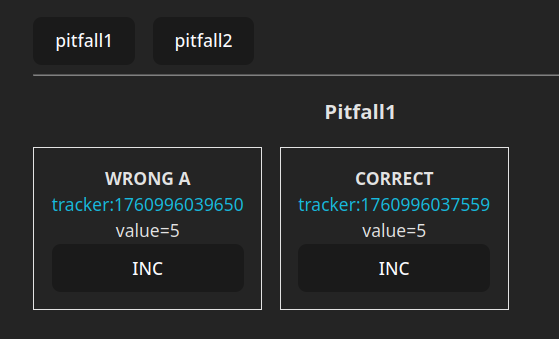
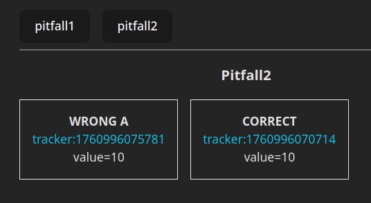

# react pitfalls

## Pitfall1

in this example is shown that [use on state variables][1] from global state that are potentially used in some child for rendering cause the render till up the parent that selected that variable even it hadn't used in its ( children excluded ) rendering.

in general select only variables effectively used in the control and split in more children component expecially in the layout pages in order to specialize the rendering effects only on children where you can select those state variables for their purpose.

## Pitfall2

in this example is shown that use of [a hook that][2] in turn use a state variable from global state cause rerendering if not confined to a child control.

see tracker advance in the wrong case.

to solve a [dummy control][3] was used to place use hooks in there ( these could useWebSocket or other application active services )

[1]: https://github.com/devel0/examples-react/blob/4157d6c65966a4c822387bf72c75e1d797e3d9e8/react-pitfalls/src/Pitfall1/Pitfall1_Wrong.tsx#L6

[2]: https://github.com/devel0/examples-react/blob/6f342f0a6097216c6d7d88895171a6cd6ba4102b/react-pitfalls/src/Pitfall2/Pitfall2_Wrong.tsx#L6

[3]: https://github.com/devel0/examples-react/blob/6f342f0a6097216c6d7d88895171a6cd6ba4102b/react-pitfalls/src/Pitfall2/Pitfall2_Correct.tsx#L5