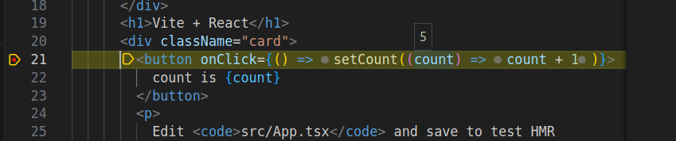

# examples react

- [examples](#examples)
- [requirements](#requirements)
- [quickstart](#quickstart)

## examples

| example                                                    | description                               |
| ---------------------------------------------------------- | ----------------------------------------- |
| [test-app](./test-app)                                     | basic skeleton spa                        |
| [zustand react singleton service](./singleton-service-app) | zustand services                          |
| [react pitfalls](./react-pitfalls)                         | common pitfalls                           |
| [load svg url](./load-svg-url)                             | load svg from url with fill customization |

## requirements

- [nodejs](https://nodejs.org/dist/v22.17.1/node-v22.17.1-linux-x64.tar.xz)

just untar into `~/opt` then symlink, ie

```sh
cd ~/opt
ln -s node-v22.17.1-linux-x64 node
```

and add path to your `~/.bashrc`

```sh
echo 'export PATH=$PATH:~/opt/node/bin' >> ~/.bashrc
```

## quickstart

to create a react app

```sh
pnpm create vite@latest test-app -- --template react-ts
```

to debug then

```sh
cd test-app
pnpm i
code .
```

from terminal of vscode

```sh
pnpm run dev
```

from vscode run/debug `create a launch.json file` and select `WebApp (Chrome)` then `Chrome (Launch)`

a file like following will be created

```json
{    
    "version": "0.2.0",
    "configurations": [
        {
            "name": "Launch Chrome",
            "request": "launch",
            "type": "chrome",
            "url": "http://localhost:8080",
            "webRoot": "${workspaceFolder}"
        }        
    ]
}
```

edit the url to the one as `npm run dev` reports, ie

```json
"url": "http://localhost:5173",
```

now hit F5 to attach the debugger

go to the `App.tsx` and place a breakpoint (F9) to the button onclick



